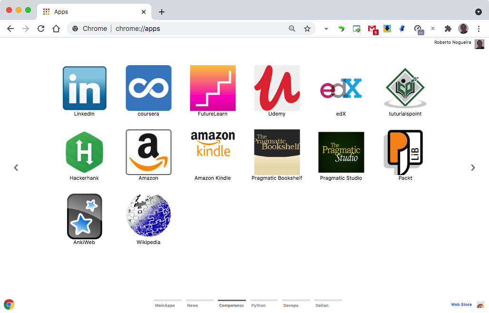

# Chrome Apps for Competence


## Installation

### 1. Clone this repository and see its contents.
Open a terminal give the following command:

```bash
$ git clone https://github.com/enogrob/chromeapps-competence.git
```

As we can see a subdirectory is created for each Eicon app.

```bash
$ ls -la
total 400
drwxr-xr-x@   7 enogrob  staff    238 Jun 16 11:40 .
drwxr-xr-x@ 377 enogrob  staff  12818 Jun 16 11:37 ..
-rw-r--r--    1 enogrob  staff     13 Oct  3  2020 .gitignore
-rw-r--r--@   1 enogrob  staff      0 Oct  3  2020 Icon?
-rw-r--r--@   1 enogrob  staff   1455 Jun 16 11:41 README.md
drwxr-xr-x   20 enogrob  staff    680 Jun 16 11:40 apps
drwxr-xr-x    4 enogrob  staff    136 May 18 05:21 images
total 400

$ tree -L 1 apps/
apps
├── Competence-Amazon
├── Competence-AnkiWeb
├── Competence-Codewars
├── Competence-Coursera
├── Competence-Edx
├── Competence-FutureLearn
├── Competence-Hackerhank
├── Competence-Kindle
├── Competence-LinkedIn
├── Competence-Manning
├── Competence-O'REILLYBooks
├── Competence-Packt
├── Competence-PragmaticBookshelf
├── Competence-PragmaticStudio
├── Competence-Scratch
├── Competence-TutorialsPoint
├── Competence-Udemy
└── Competence-Wikipedia

18 directories, 0 file
$
```

### 2. Open Chrome with the following url:
In order to load the `Chrome Apps` for Competence, check `Developer Mode` and press `Load unpacked extension...` to load each App selecting its corresponding directory inside `apps` e.g. `Competence-Amazon`, and then repeat that for the wanted apps. Or just drag and drop the app folder on the [Extensions page](chrome://extensions).

[chrome://extensions](chrome://extensions)

### 3. After load the Chrome Apps wanted for Competence, Chrome will look like the screenshot below:

